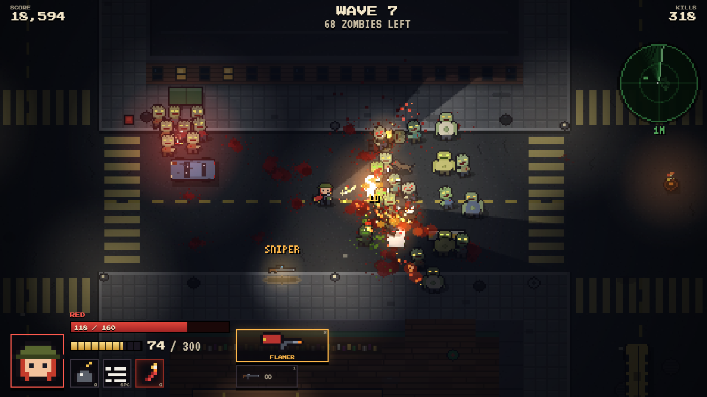
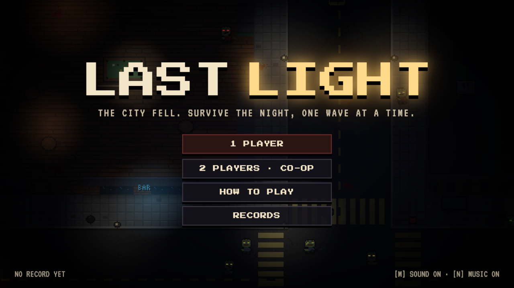
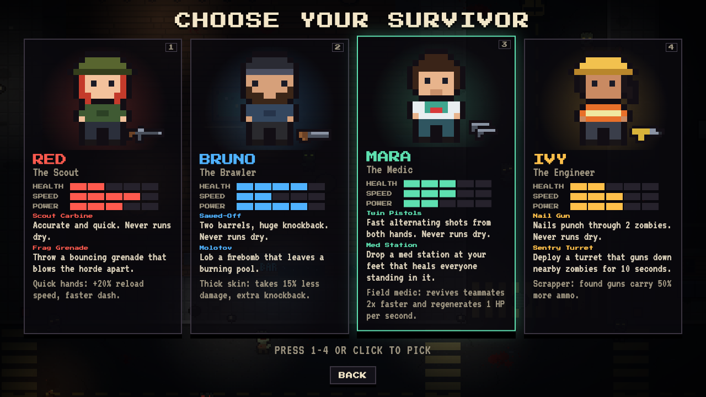
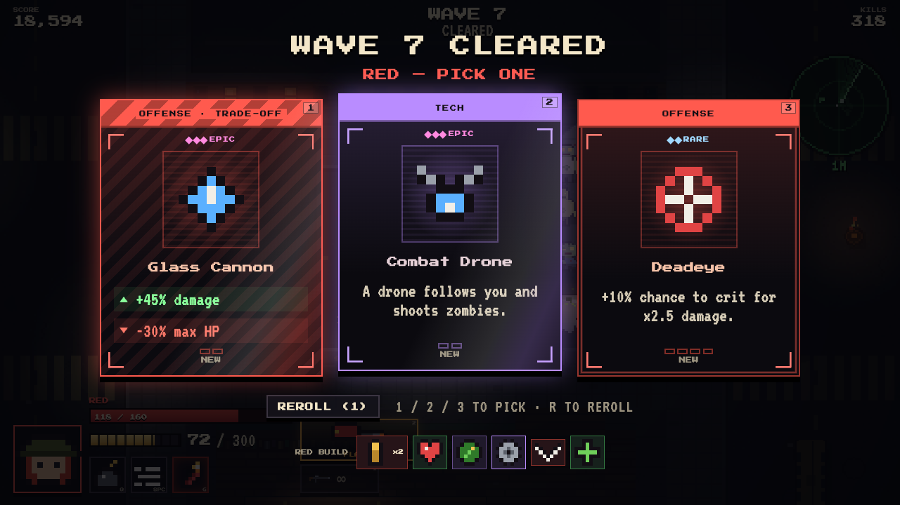
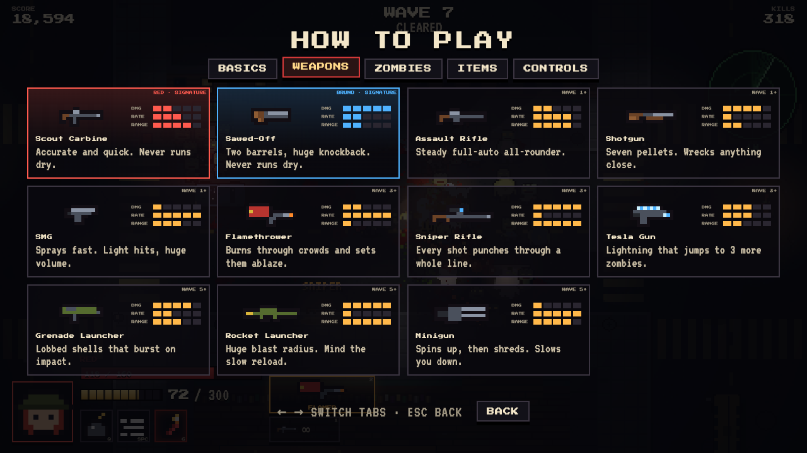

# Last Light

**A top-down pixel-art zombie survival game for the browser.** Hold out in a dark city against waves
of the undead, scavenge guns from the streets, and after every wave pick an upgrade card to build
your run. Play solo or local co-op, with keyboard, mouse or gamepads.

All the art, animation, sound and music are generated in code: no image files, no audio files and
no dependencies. Open it in a browser and play.

### [▶ Play it in your browser](https://gonchi028.github.io/zombie-game/)



<table>
  <tr>
    <td></td>
    <td></td>
  </tr>
  <tr>
    <td align="center"><sub>Title screen</sub></td>
    <td align="center"><sub>Four survivors to choose from</sub></td>
  </tr>
  <tr>
    <td></td>
    <td></td>
  </tr>
  <tr>
    <td align="center"><sub>Pick an upgrade after each wave</sub></td>
    <td align="center"><sub>Built-in How to Play guide</sub></td>
  </tr>
</table>

## Contents

- [Features](#features)
- [Quick start](#quick-start)
- [How to play](#how-to-play)
  - [Survivors](#survivors) · [Weapons](#weapons) · [Zombies](#zombies) · [Waves](#waves) ·
    [Pickups](#pickups) · [Upgrades](#upgrades) · [Co-op](#co-op)
- [Controls](#controls)
- [Under the hood](#under-the-hood)
- [Project layout](#project-layout)
- [Tweaking and modding](#tweaking-and-modding)

## Features

- **Four survivors, four playstyles.** A scout, a brawler, a medic and an engineer. Each has a
  signature gun that never runs out of ammo, a unique ability and a passive perk.
- **Guns spawn around the city.** Find 9 weapons, from SMGs and shotguns to a flamethrower, Tesla
  gun and minigun. Stronger guns turn up in later waves.
- **Waves that escalate.** Seven zombie types, including the Abomination, a boss that charges,
  slams and summons every 5th wave.
- **Special waves** twist the rules every 3rd wave: a city-wide blackout, creeping fog, a rush of
  runners and dogs, or a wave of brutes and bloaters. Survive one for a double bonus.
- **33 upgrade cards** to build your run, color-coded by what they boost: stat powerups,
  trade-off modifiers and build-defining epics like orbiting buzzsaws and combat drones.
- **Road flares** turn up when you're swarmed. Throw one and nearby zombies chase it instead of you.
- **Night-time lighting.** Flashlight cones blocked by walls, street lamps, flickering neon,
  police sirens, burning barrels and glowing zombie eyes. Blood and corpses stay where they fall.
- **An adaptive soundtrack.** Eerie ambience on the title screen, a driving track during waves that
  builds as the horde closes in, a heavier theme when the boss shows up, and a calm theme between
  waves. All of it is synthesized live.
- **Juicy animation.** Characters squash, stretch, lean and bob. Zombies flinch from hits and
  ragdoll across the street when they die.
- **Solo or local co-op**, with revives. Keyboard + mouse, arrow keys with auto-aim, or gamepads.
- **Plays on phones and tablets.** On-screen twin sticks with aim assist and thumb-sized buttons
  appear as soon as you touch the screen. A fullscreen button sits on the title screen and next to
  the pause button. On iPhones, which don't allow fullscreen web pages, it shows how to add the game
  to the Home Screen, where it opens fullscreen and in landscape like an app.
- **A built-in How to Play guide** covering every survivor, weapon, zombie, wave type, pickup and
  control.
- **A living title screen.** The city waits in the dark until you press a key, then the street lamps
  stutter back on. The LIGHT in the logo shares the city's power grid and cuts out with the lamps.
- **Records** for your best wave and score, lifetime kills, bosses slain and time survived, plus
  per-survivor stats and your favorite survivor.

## Quick start

The quickest way to play is the [online version](https://gonchi028.github.io/zombie-game/). It's
published to GitHub Pages by `.github/workflows/pages.yml` on every push to `main`.

To run it locally, note that the game is plain HTML, CSS and JavaScript ES modules. Browsers won't
load ES modules from `file://`, so serve the folder over HTTP:

```bash
git clone https://github.com/gonchi028/zombie-game.git
cd zombie-game
npm start                 # zero-dependency Node server → http://localhost:8080
```

There's nothing to install. If you don't have Node, any static server works:

```bash
python3 -m http.server 8080
```

Use a recent browser (Chrome, Edge, Firefox or Safari), on a computer, phone or tablet. Set the `PORT` environment
variable to serve on a different port.

## How to play

Each run loops through four steps:

1. **Survive the wave.** Zombies pour in from the dark. Kill them all to end the wave.
2. **Scavenge guns.** Your signature gun never runs dry, and your second slot holds the best gun
   you find on the streets.
3. **Build your run.** After each wave, every player picks 1 of 3 upgrade cards, with one reroll.
4. **Beat the boss.** The Abomination shows up every 5th wave.

Everything you need is also in the **How to Play** screen, on the title menu and the pause menu.

### Survivors

| | Red, the Scout | Bruno, the Brawler | Mara, the Medic | Ivy, the Engineer |
| --- | --- | --- | --- | --- |
| Health | 100 | 150 | 110 | 100 |
| Speed | Fast | Slow | Average | Average |
| Signature gun | **Scout Carbine**: accurate and quick | **Sawed-Off**: two barrels, huge knockback | **Twin Pistols**: fast shots from alternating hands | **Nail Gun**: nails pierce 2 zombies |
| Ability | **Frag Grenade** (7s): a bouncing grenade | **Molotov** (9s): leaves a burning pool | **Med Station** (12s): drops at her feet and heals everyone standing in it | **Sentry Turret** (14s): shoots nearby zombies for 10 seconds |
| Passive | +20% reload speed, faster dash | Takes 15% less damage, extra knockback | Revives teammates 2× faster, regenerates 1 HP/s | Found guns carry 50% more ammo |

Red outruns the horde, and Bruno can take a beating and hits hardest up close. Mara keeps a team
alive and shines in co-op. Ivy turns any street corner into a defensive position.

### Weapons

You carry two guns. **Slot 1** is your survivor's signature gun, with unlimited reserve ammo.
**Slot 2** starts empty and holds whatever you find.

- Guns appear around the city during waves. The first comes about 7 seconds in, then one every
  18–30 seconds. Off-screen guns get an orange arrow at the edge of the screen.
- **Walk over a gun** to pick it up if your slot is empty. Walking over the same gun you already
  carry adds ammo.
- **A different gun** shows a prompt. Press the pickup key to swap, and your old gun drops on the
  ground with its ammo, so you can change your mind.
- When a found gun runs dry, you switch back to your signature gun automatically.

| Gun | Damage | Fire rate | Mag / reserve | Appears from | Notes |
| --- | --- | --- | --- | --- | --- |
| Scout Carbine | 15 | 6.5/s | 24 / ∞ | Red's signature | Accurate, quick reload |
| Sawed-Off | 7 × 11 | 3.2/s | 2 / ∞ | Bruno's signature | Huge knockback, short range |
| Twin Pistols | 10 | 8/s | 24 / ∞ | Mara's signature | Shots alternate between hands |
| Nail Gun | 12 | 5.5/s | 30 / ∞ | Ivy's signature | Nails pierce 2 zombies |
| Assault Rifle | 13 | 9/s | 30 / 210 | Wave 1 | Steady full-auto all-rounder |
| Shotgun | 7 × 10 | 1.4/s | 6 / 42 | Wave 1 | Wrecks anything close |
| SMG | 8 | 15/s | 40 / 280 | Wave 1 | Light hits, huge volume |
| Flamethrower | 4 + burn | 22/s | 100 / 300 | Wave 3 | Passes through crowds, sets zombies on fire |
| Sniper Rifle | 95 | 1/s | 5 / 30 | Wave 3 | Pierces 6 zombies |
| Tesla Gun | 22 | 5/s | 30 / 150 | Wave 3 | Lightning chains to 3 more zombies |
| Grenade Launcher | 55 (blast) | 1.6/s | 6 / 30 | Wave 5 | Lobbed shells burst on impact |
| Rocket Launcher | 30 + 80 blast | 1.1/s | 4 / 20 | Wave 5 | Big blast radius, slow reload |
| Minigun | 9 | 24/s | 200 / 600 | Wave 5 | Spins up first, slows you while firing |

### Zombies

| Zombie | First seen | What to know |
| --- | --- | --- |
| Walker | Wave 1 | Slow and stubborn. The bulk of every wave. |
| Runner | Wave 2 | Fast and fragile. Keep moving. |
| Zombie Dog | Wave 3 | Lunges at you from range. Hard to outrun. |
| Spitter | Wave 4 | Keeps its distance and lobs acid. |
| Brute | Wave 4 | Huge health, shrugs off knockback. |
| Bloater | Wave 6 | Explodes up close and hurts everyone nearby, zombies included. Pop it early. |
| **The Abomination** | Every 5th wave | Charges, slams the ground and summons walkers. Bait it into a wall and it stuns itself. Road flares don't fool it. |

### Waves

Every wave brings more zombies and tougher ones: more health, more speed and more damage. Up to 95
zombies can be alive at once in later waves. From wave 10, boss waves bring two Abominations.
Co-op waves are 50% bigger.

**Special waves.** From wave 3, every 3rd wave twists the rules. It's never a boss wave and never
the same twist twice in a row. Surviving one pays a **double survival bonus**, and the soundtrack
reacts to each.

| Special wave | From | What happens |
| --- | --- | --- |
| **Blackout** | Wave 3 | The street lights flicker and die. Only flashlights, fire and glowing eyes cut the dark. The lights come back when the wave is cleared. |
| **The Rush** | Wave 3 | Only runners and zombie dogs, 20% more of them, arriving almost twice as fast. The music speeds up. |
| **Fog** | Wave 6 | Thick fog rolls in. You can only see clearly close to your survivor, and flashlights reach less far. The Motion Tracker still sees through it. |
| **Heavy Hitters** | Wave 6 | Only brutes and bloaters. About a third as many zombies, but each one hits hard. |

Clearing a wave gives a score bonus. Before the next wave starts, every survivor gets a little
health and ammo back, and fallen co-op partners rejoin. Your best wave and score are saved in the
browser.

### Pickups

Zombies sometimes drop pickups when they die:

| Pickup | Effect |
| --- | --- |
| Ammo | Reserve ammo for your found gun. Only drops while someone carries one. |
| Medkit | Heals 30 HP. |
| Rage | Double damage for 10 seconds. |
| Max Ammo | Refills every gun on the team. |
| **Road Flare** | Drops more often the more zombies crowd you. You can hold one. Throw it and zombies that can see it chase it for about 6 seconds, then it pops in a small explosion. |

### Upgrades

After each wave, each player picks 1 of 3 upgrade cards and gets one reroll. Cards are colored by
what they boost, and their frames show rarity: plain for common, double-framed for rare, foil and
glowing for epic. Epic cards get more common as the waves go on. Striped **trade-off** cards give a
big upside for a real downside.

<details>
<summary><b>All 33 upgrades</b></summary>

| Upgrade | Category | Rarity | Effect |
| --- | --- | --- | --- |
| Hollow Points | Offense | Common | +15% damage |
| Hair Trigger | Offense | Common | +12% fire rate |
| Tough Skin | Defense | Common | +25 max HP and heal 25 |
| Running Shoes | Mobility | Common | +8% move speed |
| Extended Mags | Ammo | Common | +35% magazine size |
| Speed Loader | Ammo | Common | +25% reload speed |
| Bandolier | Ammo | Common | +50% max reserve ammo, refills all ammo |
| Scavenger | Tech | Common | +60% pickup range, +30% drop chance |
| Adrenal Glands | Defense | Common | Regenerate 1 HP per second |
| Kevlar Vest | Defense | Common | Take 10% less damage |
| First Aid | Defense | Common | Fully heal right now |
| FMJ Rounds | Offense | Rare | Bullets pierce +1 zombie |
| Double Tap | Offense | Rare | +1 projectile per shot (+3 pellets for shotguns) |
| Deadeye | Offense | Rare | +10% chance to crit for ×2.5 damage |
| Ricochet | Offense | Rare | Bullets bounce off walls +1 time |
| Incendiary Rounds | Offense | Rare | 15% chance to set zombies on fire |
| Cryo Rounds | Offense | Rare | Hits slow zombies by 40% |
| Spiked Armor | Defense | Rare | Getting hit releases a 40-damage shockwave |
| Parkour | Mobility | Rare | -30% dash cooldown, dashing through zombies hurts them |
| Demolitions | Tech | Rare | -25% ability cooldown, +25% ability radius |
| Bloodthirst | Defense | Rare | Heal 1 HP for every kill |
| Stopping Power | Offense | Rare | +60% knockback and +10% damage |
| Motion Tracker | Tech | Rare | A radar that pings zombies around you |
| Deep Scan | Tech | Rare | +60% tracker range, and the tracker shows pickups and guns |
| Trigger Happy | Offense | Rare · trade-off | +35% fire rate, but +50% spread |
| Juggernaut | Defense | Rare · trade-off | +60 max HP, but -10% move speed |
| Explosive Rounds | Offense | Epic | 15% chance for hits to explode |
| Tesla Coil | Offense | Epic | 15% chance for hits to arc lightning to 3 zombies |
| Buzzsaw | Tech | Epic | A saw blade orbits you, shredding zombies |
| Combat Drone | Tech | Epic | A drone follows you and shoots zombies |
| Second Wind | Defense | Epic | Cheat death once: get back up with 50% HP |
| Glass Cannon | Offense | Epic · trade-off | +45% damage, but -30% max HP |
| Berserker | Offense | Epic · trade-off | Up to +60% damage and fire rate the lower your HP |

</details>

### Co-op

Pick **2 Players** on the title screen. Player 1 chooses a survivor, then player 2 chooses from the
other three.

- Player 1 uses keyboard + mouse. Player 2 uses the first gamepad, or the arrow keys with auto-aim.
  With two gamepads, player 1 can use the second one.
- When a survivor goes down, they have 30 seconds to be revived. Stand next to them for about 2
  seconds to bring them back, or 1 second if you're Mara.
- The run ends when nobody is left standing. Survivors who bled out rejoin at the start of the next
  wave.

## Controls

| Action | Player 1 (keyboard + mouse) | Player 2 (arrow keys) | Gamepad | Touch (player 1) |
| --- | --- | --- | --- | --- |
| Move | `W` `A` `S` `D` | Arrows | Left stick | Drag on the left half |
| Aim | Mouse | Auto-aim (nearest zombie) | Right stick | Drag on the right half |
| Shoot | Left click | `Enter` | RT | Push the aim stick further |
| Ability | `Q` / right click | `/` | LT / LB | Ability button |
| Dash | `Space` / `Left Shift` | `Right Shift` | A | Dash button |
| Reload | `R` | `.` | X | Reload button |
| Swap gun | `E` / wheel / `1` `2` | `,` | Y | Swap button (shows your other gun) |
| Pick up gun | `F` | `;` | X (near a gun) | Reload button (turns into TAKE) |
| Road flare | `G` | `'` | B | Flare button |
| Pause | `Esc` / `P` | | Start | `II` in the top-left corner |

`M` mutes everything and `N` turns the music on or off. Both are remembered between visits. On the
upgrade screen, press `1` `2` `3` to pick a card and `R` to reroll. Menus work
with the mouse, the arrow keys, a gamepad's D-pad or a tap.

The touch controls show up when you touch the screen, and go away when you move a mouse. The move
and aim sticks appear wherever your thumbs land. The aim stick has a little aim assist: it locks on to
a zombie within about 20° of where you point. In co-op on a tablet, player 2 uses a gamepad.

For fullscreen, tap the corner button on the title screen or next to the pause button (on desktop,
it's also in the pause menu). iPhones don't let web pages go fullscreen, so there the button explains
how to add Last Light to the Home Screen instead: tap Share, then **Add to Home Screen**.

## Under the hood

- **No build step and no dependencies.** Plain ES modules, a `<canvas>` and a little DOM for the
  menus and HUD. `server.js` is a ~30-line static file server.
- **Pixel-perfect rendering.** The world renders to a 480×270 canvas scaled up with nearest-neighbor
  filtering. The DOM UI is sized in the same "game pixels" (`var(--s)` in the CSS), so the whole
  game stays crisp at any window size.
- **Art as code.** Every sprite is a palette-indexed string in `js/sprites.js`, baked to canvases at
  boot along with mirrored, hit-flash and corpse variants. The city is generated from a fixed seed,
  so it's the same every run.
- **Procedural animation.** Spring-driven squash and stretch, footstep bobs, leans, hit flinches and
  ragdoll deaths are layered on top of a few hand-drawn frames (`js/anim.js`).
- **Lighting.** A darkness layer is lit by flashlight cones raycast against walls, plus additive
  glows from lamps, fire, muzzle flashes and flares.
- **Zombie AI.** A Dijkstra flow field toward the players is recomputed a few times a second, so a
  horde of up to 95 zombies paths around buildings cheaply. A spatial grid handles crowd separation
  and hit tests.
- **Sound and music.** Every effect is synthesized with the Web Audio API from oscillators and
  filtered noise. The soundtrack (`js/music.js`) is a small step sequencer that schedules synthesized
  drums, bass, pads, arpeggios and bells slightly ahead of the audio clock. It switches between five
  moods (title, wave, boss, calm, game over) with crossfades. During waves, layers fade in as zombies
  close in on you. Pausing muffles and lowers it.

## Project layout

```
index.html          DOM shell: menus, HUD and the guide overlay the canvas
manifest.webmanifest  lets phones install the game to the Home Screen (fullscreen, landscape)
icons/              Home Screen icons, scaled up from the favicon's pixel zombie
css/style.css       UI styling; 1 "game pixel" = var(--s)
server.js           tiny static server for `npm start`
.github/workflows/  pages.yml publishes the game to GitHub Pages on every push to main
docs/screenshots/   images for this README
js/
  main.js           boot, game loop, pause and menu wiring
  game.js           world simulation and rendering: combat, pickups, weapon drops, flares, lighting
  map.js            city generator, baked tile art, props and colliders, flow-field pathfinding
  player.js         survivor movement, dash, two-slot loadout, firing, abilities, saws and drones
  zombie.js         zombie AI: per-type behaviors, boss state machine, procedural poses
  waves.js          wave composition, scaling and spawn placement
  upgrades.js       upgrade card pool, categories, rarities and roll logic
  data.js           weapons, survivors and zombie base stats  ← start here to tune balance
  sprites.js        all pixel art as palette strings, baked to canvases at boot
  anim.js           procedural animation: springs, poses, easing
  lighting.js       darkness overlay, raycast flashlight cones, additive glows
  particles.js      particles and permanent decals: blood, corpses, ragdolls, scorch marks
  tracker.js        motion tracker radar (Motion Tracker and Deep Scan upgrades)
  audio.js          procedural Web Audio sound effects
  music.js          procedural adaptive soundtrack: step sequencer, synth instruments, moods
  input.js          keyboard, mouse, gamepad and touch input, plus per-player controllers
  touch.js          on-screen sticks and buttons for phones and tablets
  fullscreen.js     fullscreen toggle (with the prefixed API older iPads need)
  ui.js             menus, upgrade cards, HUD and weapon rack
  records.js        lifetime records saved after every game over (shown on the Records screen)
  guide.js          the How to Play screen, built from the game's own data and sprites
  dom.js            small DOM helpers shared by the menus and the guide
  font.js           3×5 bitmap font for in-world text
  config.js         screen size, tile size, darkness level, player colors
  utils.js          math, random, pixel-drawing and storage helpers
```

## Tweaking and modding

- **Balance.** Weapon, survivor and zombie numbers live in `js/data.js`. Wave size and mix are in
  `js/waves.js` (`mix()` and `start()`), and the special waves are in `SPECIALS` in the same file.
  Each one sets its own zombie mix, size and spawn speed, and `SPECIAL_EVERY` controls how often
  they come. Gun drop timing is at the top of `js/game.js`
  (`FIRST_DROP`, `DROP_EVERY`, `MAX_DROPS`), and which guns show up when is in `pickDropWeapon()`.
  Road flare timing and lure radius are next to them (`FLARE_TIME`, `LURE_R`).
- **New gun.** Add an entry to `WEAPONS` in `js/data.js`, with a `tier` (1–3) so it can drop and a
  `desc` for the guide. Draw it in `GUN_ART` in `js/sprites.js`. It shows up in drops, the HUD and
  the How to Play guide automatically.
- **New survivor.** Add an entry to `CHARACTERS` in `js/data.js` with stats, a signature gun, an
  ability and the `abilityIcon` shown on the HUD. Draw a head, a body and a palette in
  `js/sprites.js` and register them in `SPR.players`. Character select and the guide pick it up
  automatically. A brand-new ability also needs code in `useAbility()` in `js/game.js`. Thrown
  abilities that set something up where they land, like the med station and turret, go through
  `deploy()`.
- **New upgrade.** Add an entry to `UPGRADES` in `js/upgrades.js` with an `apply(player)` function,
  and an optional `cond(player)` to control when it can be offered. Add its id to a `CATEGORY` list
  to give the card its color.
- **Music.** Each mood in `js/music.js` is a method that gets called once per 16th note. Change the
  chords, bass patterns or tempo in the `WAVE`, `BOSS` and `CALM` tables at the top, or the
  volume in `VOLUME`.
- **New art.** Sprites are strings in `js/sprites.js`. Each character is a palette key, and `.` is
  transparent.
- **Debugging.** The live game object is `window.__game` in the browser console.
